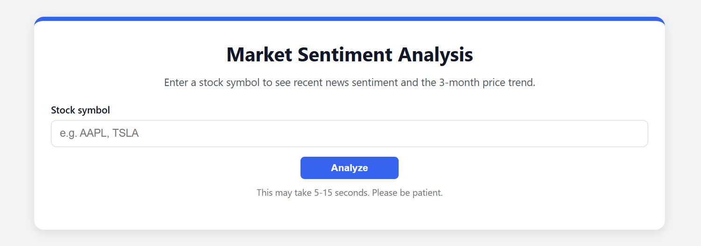
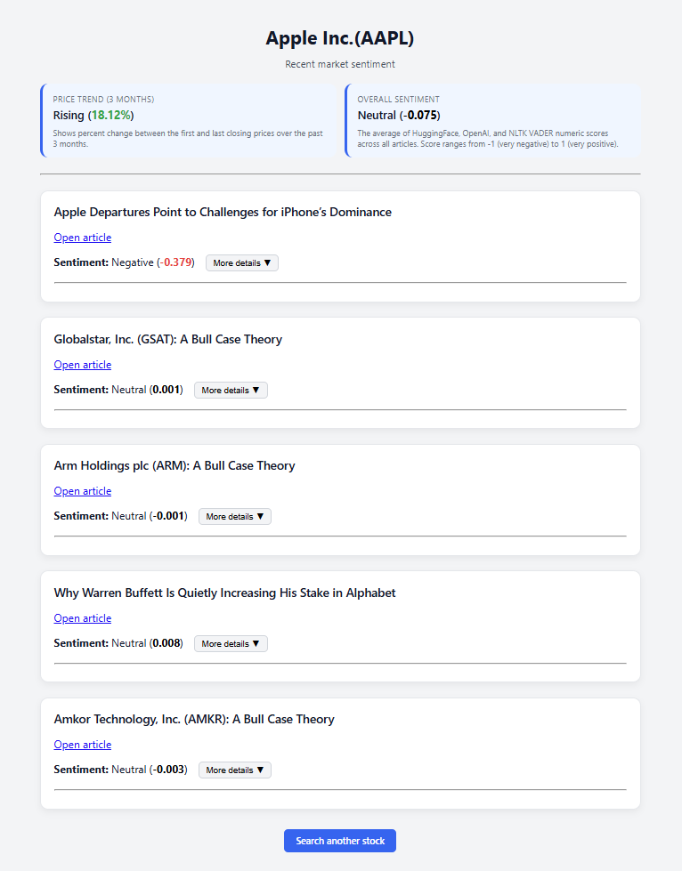

# Market Sentiment Analyzer
Evaluates market sentiment of desired stocks using recent news articles.

Program by Tauria and Grace. 

## Table of Contents
- [The Big Idea](#the-big-idea)
- [Instructions](#instructions)
- [Running the Web App](#running-the-web-app)
  - [How to Use the App](#how-to-use-the-app)
- [Implementation](#implementation)
  - [How Sentiment Classification Works](#how-sentiment-classification-works)
- [Results](#results)
- [Project Evolution](#project-evolution)
- [Project Structure](#project-structure)
- [Attribution](#attribution)
- [AI Assistance Statement](#ai-assistance-statement)

## The Big Idea
This project builds a web app that takes a stock ticker, pulls recent news articles from Yahoo Finance, and analyzes how positive or negative the overall market sentiment is. It also shows whether the stock price has been rising, falling, or staying flat over the past three months.

The main goal was to apply Python to real-world financial data and understand how the finance community reacts to news. Our product is a web app optimized for ease of use. The user enters a ticker, then gets a clear summary. This makes stock analysis more accessible to students, investors, or anyone curious about how news tone might relate to price trends.

## Instructions
### Requirements
You need:
- Python 3.9+
- pip
- An OpenAI API key

Everything else installs automatically.

### Step 1: Clone the repository
```
git clone <your-repo-url>
cd <project-folder>
```

#### Verify the structure:
```
project/
│
├── app.py
├── analysis.py
├── requirements.txt
├── README.md
├── .env
│
├── templates/
│   ├── index.html
│   ├── result.html
│   └── error.html
│
└── static/
    └── styles.css
```

### Step 2: Create and activate a virtual environment

macOS / Linux:
```
python3 -m venv venv
source venv/bin/activate
```


Windows:
```
python -m venv venv
venv\Scripts\activate
```

### Step 3: Install dependencies
```
pip install -r requirements.txt
```

This installs all of the necessary libraries.


### Step 4: Set your environment variable

Create a .env file in the root folder and input your OpenAI API key:
```
OPENAI_API_KEY=your_key_here
```

That’s the only key needed. HuggingFace and NLTK run locally.


## Running the Web App
Run this command in your terminal:
```
python app.py
```
This initiates the Flask server.

#### Note: NLTK Setup (Only if You See a Warning)

The app automatically checks for the VADER sentiment lexicon when it runs.
You may see an error such as:
```
LookupError: Resource vader_lexicon not found
```
If you do, run the following command once:
```
python -c "import nltk; nltk.download('vader_lexicon')"
```

This installs the NLTK data used by the VADER sentiment model.

Once the server launches, open your browser at:
http://127.0.0.1:5000

### How to use the app


1. Enter a stock ticker
2. Click Analyze
3. View results
4. Click Search another stock to run again

## Implementation

Below is the general flow the app follows:

### Step 1: User enters a stock ticker
The home page shows a form where the user types in a stock ticker. After they submit it, the program uses that ticker to start the analysis.


### Step 2: Fetch stock price data
The app uses `yfinance` to download the last three months of closing prices.  

It compares the first and last prices to decide whether the stock has been rising, falling, or stagnant during that period.


### Step 3: Pull Yahoo Finance News
The app sends a request to the Yahoo Finance Search API to get recent news articles related to the ticker. The app analyzes five of the most recent articles returned by the Yahoo Finance Search API.


### Step 4: Extract article text
The app downloads and reads the full text of each article using `newspaper3k`.

If it cannot get the full text, it uses the article title instead.


### Step 5: Run three sentiment models
Each article is analyzed using three different tools:

- HuggingFace transformer  
- OpenAI model
- NLTK VADER  

Each tool gives a score between –1 and 1, representing negative to positive sentiment.

#### Note on Text Length and Token Limits

- **HuggingFace model:**  
  The article text is split into 400-character chunks. Each chunk is analyzed separately, and the scores are averaged to produce a final HuggingFace sentiment score.

- **OpenAI model:**  
  Only the first 4000 characters of each article are sent to the model. This prevents exceeding token limits and ensures consistent JSON output.

- **NLTK VADER:**  
  VADER processes the full text when it is available.


These constraints ensure each model runs reliably without exceeding length or token limits.


### Step 6: Combine the scores
The app averages the three scores for each article to assign a final label (Positive, Neutral, or Negative).  

Then, it averages all article scores to generate the overall sentiment for the entire stock.

#### How Sentiment Classification Works

The final sentiment label uses the following thresholds:
- Positive if the combined score is greater than +0.2
- Negative if the combined score is less than -0.2
- Neutral otherwise


## Results

The program shows a summary of the stock’s recent news sentiment. At the top of the results page, the 3-month price trend and the overall sentiment score across all models are displayed.

Below that, the app lists five recent news articles pulled from Yahoo Finance. Each article card shows the title, its link, and a combined sentiment score for that article. If the user wants more detail, they can click “More details” to expand a small section that displays the individual scores from HuggingFace, OpenAI, and VADER. If desired, the user can click the “Search another stock” button to be taken back to the input page.




## Project Evolution

This project underwent a series of major changes during its development. Initially, it only pulled article headlines and ran one sentiment model. During testing, it became clear that using headlines alone was too limited, so full article text extraction was added.

Once the sentiment analysis worked, the project was expanded to include price-trend data to give more context behind the news. At that point, two additional models (HuggingFace and VADER) were added to give a more balanced output and explore the differences between analysis tools.

Next was the user interface. The early version of the interface was plain, and several rounds of layout adjustments were made to make the information easier to read. Originally, only the overall sentiment was going to be displayed, but both the per article scores and individual model scores were included for transparency and user understanding. Small visual improvements were made throughout, including matching styles between pages and reorganizing how the results are presented.


## Attribution

The project uses:
- `yfinance` to get stock data  
- Yahoo Finance public search API to find news articles  
- `newspaper3k` to extract article text  
- Three sentiment analysis models:  
  - HuggingFace `transformers`
  - `nltk` VADER  
  - `openai` API  
- `flask` to run the web app  

All libraries are open source.


## AI Assistance Statement

ChatGPT was used during the project, mainly for:
- Formatting the UI, such as refining the CSS and HTML templates
- Debugging the code
- Guiding web app design decisions to improve the user experience